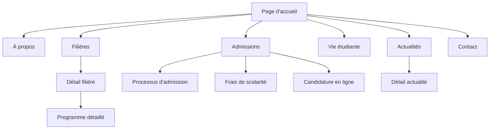
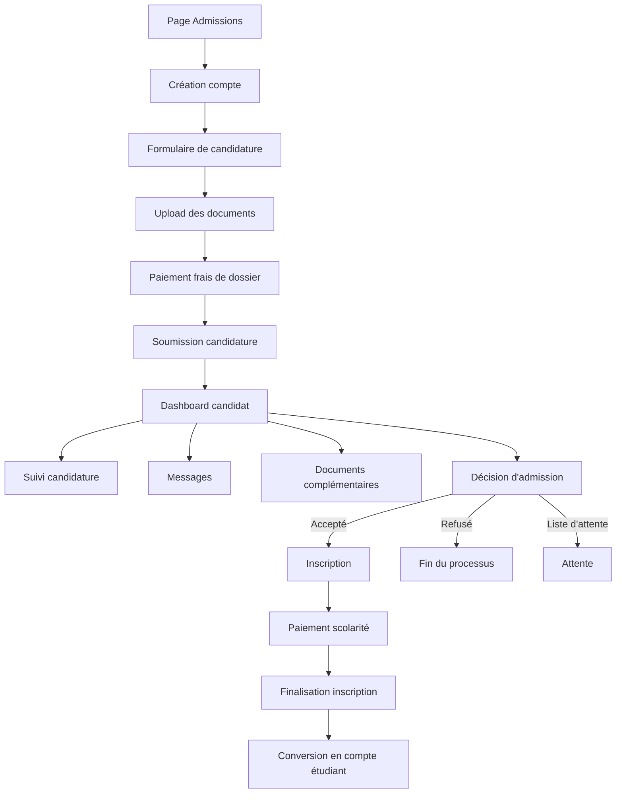
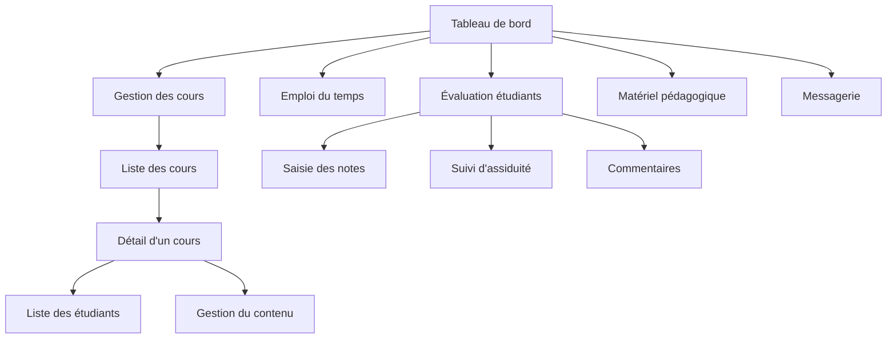

# Document de Flux Applicatifs (App Flow)
# Site Web École Supérieure au Gabon

## 1. Introduction

Ce document décrit les flux applicatifs principaux du site web de l'École Supérieure au Gabon. Il vise à définir les parcours utilisateurs, les interactions entre composants, et les transitions entre différents états de l'application. Ce guide servira de référence pour l'implémentation des fonctionnalités et l'intégration des différentes parties du système.

## 2. Architecture des flux

### 2.1 Vue d'ensemble

L'application web est structurée selon les zones fonctionnelles suivantes :

1. **Zone publique** : Pages accessibles à tous les visiteurs
2. **Zone candidature** : Flux d'inscription et de suivi des candidatures
3. **Portail étudiant** : Espace personnel des étudiants inscrits
4. **Portail professeur** : Espace de gestion pour le corps enseignant
5. **Portail administratif** : Interface de gestion pour le personnel administratif
6. **Système transversal** : Authentification, notifications, recherche

### 2.2 Dépendances principales

```
┌─────────────────────┐     ┌────────────────────────┐
│                     │     │                        │
│  Frontend (Next.js) │────▶│ Backend API (Supabase) │
│                     │     │                        │
└─────────────────────┘     └────────────────────────┘
          │                              │
          │                              │
          ▼                              ▼
┌─────────────────────┐     ┌────────────────────────┐
│                     │     │                        │
│ Service Workers     │     │ Système de stockage    │
│ (Offline support)   │     │ (Supabase Storage)     │
│                     │     │                        │
└─────────────────────┘     └────────────────────────┘
```

### 2.3 État global et gestion des données

- **État d'authentification** : Géré via Supabase Auth et contexte React
- **État de l'interface** : Géré via Zustand ou Redux pour les états UI complexes
- **Données de contenu** : Chargées depuis Supabase et mises en cache côté client
- **Préférences utilisateur** : Stockées localement et synchronisées avec le profil en ligne

## 3. Flux utilisateur - Zone publique

### 3.1 Navigation principale



### 3.2 Flux de recherche

```
┌──────────────┐     ┌───────────────────┐     ┌────────────────────┐
│              │     │                   │     │                    │
│ Saisie terme │────▶│ Suggestions live  │────▶│ Page de résultats  │
│              │     │                   │     │                    │
└──────────────┘     └───────────────────┘     └────────────────────┘
                                                          │
                                                          │
                                                          ▼
                                               ┌────────────────────┐
                                               │                    │
                                               │ Filtres et tri     │
                                               │                    │
                                               └────────────────────┘
```

**Détails du flux** :
1. L'utilisateur commence à saisir un terme dans la barre de recherche
2. Des suggestions apparaissent en temps réel sous la barre de recherche
3. En validant sa recherche, l'utilisateur est dirigé vers la page de résultats
4. Les résultats sont organisés par catégories (Filières, Actualités, Pages, etc.)
5. L'utilisateur peut filtrer et trier les résultats

### 3.3 Flux de consultation de filière

**Séquence** :
1. L'utilisateur accède à la page "Filières" depuis la navigation principale
2. Il visualise la liste des filières sous forme de grille avec filtres
3. En cliquant sur une filière, il accède à sa page détaillée
4. La page détaillée présente les onglets : Présentation, Programme, Débouchés, Équipe
5. L'utilisateur peut naviguer entre ces onglets sans rechargement de page
6. Un CTA "Candidater" est présent de manière persistante

**Interactions UI** :
- Animation de transition entre les onglets
- Lazy loading des images de l'équipe pédagogique
- Expansion/contraction des modules de cours
- Téléchargement de brochure PDF

## 4. Flux utilisateur - Candidature

### 4.1 Processus de candidature complet



### 4.2 Formulaire de candidature multi-étapes

**Structure** :
1. **Étape 1** : Informations personnelles
   - Données d'état civil
   - Coordonnées
   - Photo d'identité
   
2. **Étape 2** : Parcours académique
   - Diplômes obtenus
   - Établissements fréquentés
   - Relevés de notes
   
3. **Étape 3** : Choix de formation
   - Sélection de la filière principale
   - Options secondaires
   - Projet professionnel
   
4. **Étape 4** : Documents administratifs
   - Carte d'identité/passeport
   - Diplômes
   - Lettres de recommandation
   
5. **Étape 5** : Validation et paiement
   - Résumé de la candidature
   - Paiement des frais de dossier
   - Soumission finale

**Fonctionnalités clés** :
- Sauvegarde automatique à chaque étape
- Possibilité de quitter et reprendre plus tard
- Validation en temps réel des champs
- Progression visuelle (barre de progression)
- Détection de formulaires incomplets

### 4.3 Tableau de bord du candidat

**Composants** :
- Vue d'ensemble du statut de candidature
- Timeline du processus
- Messagerie avec le service d'admission
- Notification des étapes franchies
- Accès aux documents soumis
- Fonctionnalité de mise à jour des informations

**États possibles de candidature** :
1. Brouillon
2. Soumise
3. En cours d'examen
4. Documents manquants
5. Entretien programmé
6. Décision en attente
7. Acceptée
8. Liste d'attente
9. Refusée

## 5. Flux utilisateur - Portail étudiant

### 5.1 Vue d'ensemble du portail

```
┌───────────────────┐     ┌───────────────────┐     ┌───────────────────┐
│                   │     │                   │     │                   │
│   Tableau de bord │────▶│  Cours & Notes    │────▶│  Emploi du temps  │
│                   │     │                   │     │                   │
└───────────────────┘     └───────────────────┘     └───────────────────┘
         │                         │                         │
         │                         │                         │
         ▼                         ▼                         ▼
┌───────────────────┐     ┌───────────────────┐     ┌───────────────────┐
│                   │     │                   │     │                   │
│    Documents      │────▶│     Paiements     │────▶│     Messages      │
│                   │     │                   │     │                   │
└───────────────────┘     └───────────────────┘     └───────────────────┘
```

### 5.2 Flux d'inscription aux cours

**Séquence** :
1. L'étudiant accède à la section "Inscription aux cours"
2. Il visualise les cours disponibles pour son semestre/année
3. Il sélectionne les cours obligatoires et optionnels
4. Le système vérifie les prérequis et les conflits d'horaire
5. L'étudiant valide sa sélection
6. Un récapitulatif est présenté pour confirmation
7. La confirmation génère l'emploi du temps et met à jour le tableau de bord

**Validation et règles** :
- Vérification du nombre de crédits minimum/maximum
- Détection des cours obligatoires manquants
- Alerte en cas de conflit d'horaire
- Vérification des prérequis académiques

### 5.3 Flux de consultation des notes

**Séquence** :
1. L'étudiant accède à la section "Notes et évaluations"
2. Par défaut, le semestre en cours est affiché
3. L'étudiant peut changer de période (semestre précédent, année complète)
4. Les notes sont présentées par cours avec détail des évaluations
5. Un calcul de moyenne est affiché pour chaque cours et pour le semestre
6. L'étudiant peut télécharger un relevé de notes officiel

**Visualisations** :
- Graphique d'évolution des moyennes par semestre
- Vue comparative avec la moyenne de promotion (anonymisée)
- Code couleur pour identifier rapidement les points forts/faibles

### 5.4 Flux de paiement de frais

**Séquence** :
1. L'étudiant accède à la section "Paiements et finances"
2. Il visualise l'état de son compte (montants dus, échéances)
3. Il sélectionne une facture à payer
4. Il choisit un mode de paiement (carte bancaire, mobile money, virement)
5. Il est redirigé vers la passerelle de paiement sécurisée
6. Après paiement, il est redirigé vers une page de confirmation
7. Le statut de paiement est mis à jour en temps réel

**Fonctionnalités** :
- Téléchargement des reçus et factures
- Historique des transactions
- Demandes de facilités de paiement
- Alertes pour échéances à venir

## 6. Flux utilisateur - Portail professeur

### 6.1 Vue d'ensemble du portail



### 6.2 Flux de gestion d'un cours

**Séquence** :
1. Le professeur accède à la liste de ses cours
2. Il sélectionne un cours spécifique
3. Il accède au tableau de bord du cours avec plusieurs onglets :
   - Informations générales
   - Liste des étudiants inscrits
   - Contenu du cours (modules, séances)
   - Évaluations et notes
   - Ressources pédagogiques
4. Il peut modifier le contenu, ajouter des ressources ou gérer les évaluations

**Interactions clés** :
- Upload de documents (supports de cours, exercices)
- Publication d'annonces pour les étudiants
- Création d'évaluations avec barèmes
- Modification du planning des séances

### 6.3 Flux de saisie des notes

**Séquence** :
1. Le professeur accède à la section "Évaluations" d'un cours
2. Il crée une nouvelle évaluation ou sélectionne une existante
3. Il accède à la grille de saisie avec la liste des étudiants
4. Il peut saisir les notes individuellement ou importer un fichier CSV
5. Le système calcule automatiquement les statistiques (moyenne, médiane, etc.)
6. Le professeur valide la publication des notes
7. Les étudiants reçoivent une notification

**Fonctionnalités avancées** :
- Système de notation paramétrable (sur 20, lettres, validation de compétences)
- Grille de critères d'évaluation
- Commentaires individuels par étudiant
- Comparaison avec les évaluations précédentes

## 7. Flux utilisateur - Portail administratif

### 7.1 Gestion des admissions

**Séquence principale** :
1. L'administrateur accède au tableau de bord des admissions
2. Il visualise les candidatures par statut (nouvelles, en cours, complètes)
3. Il peut filtrer par filière, date, statut
4. En sélectionnant une candidature, il accède au dossier complet
5. Il peut évaluer le dossier, ajouter des commentaires, demander des compléments
6. Il peut changer le statut de la candidature
7. Il peut générer une décision (admission, refus, liste d'attente)

**Workflow de décision** :
```
┌───────────────┐     ┌───────────────┐     ┌───────────────┐
│               │     │               │     │               │
│ Examen initial│────▶│ Évaluation    │────▶│  Décision     │
│               │     │               │     │               │
└───────────────┘     └───────────────┘     └───────────────┘
                              │
                              │
                              ▼
                     ┌───────────────┐
                     │               │
                     │Complément info│
                     │               │
                     └───────────────┘
```

### 7.2 Gestion du contenu du site

**Flux de publication d'actualité** :
1. L'administrateur accède à la section "Gestion de contenu"
2. Il sélectionne "Actualités" puis "Nouvelle actualité"
3. Il remplit le formulaire (titre, contenu, catégorie, image)
4. Il peut enregistrer en brouillon ou publier directement
5. Il peut programmer une date de publication future
6. Il peut définir la mise en avant sur la page d'accueil
7. Après publication, l'actualité apparaît dans la section publique

**Gestion des pages** :
- Édition des pages existantes via éditeur WYSIWYG
- Système de révisions et historique des modifications
- Prévisualisation avant publication
- Gestion des méta-données SEO
- Publication/dépublication programmée

### 7.3 Tableau de bord analytique

**Composants** :
- Vue d'ensemble des KPIs principaux
- Graphiques de fréquentation du site
- Rapports d'admission par filière
- Taux de conversion des visiteurs en candidats
- Statistiques d'engagement (téléchargements, formulaires)

**Fonctionnalités analytiques** :
- Filtrage par période
- Exportation des données (CSV, PDF)
- Rapports automatiques périodiques
- Alertes sur objectifs atteints/manqués

## 8. Flux transversaux

### 8.1 Authentification et gestion de compte

**Flux d'inscription** :
1. L'utilisateur clique sur "Créer un compte" depuis la page d'accueil ou de connexion
2. Il renseigne ses informations de base (email, nom, prénom, mot de passe)
3. Il reçoit un email de confirmation avec lien d'activation
4. En cliquant sur le lien, son compte est activé
5. Il est redirigé vers un formulaire de complétion de profil
6. Après complétion, il accède à son espace personnel (candidat par défaut)

**Flux de connexion** :
```
┌───────────────┐     ┌───────────────┐     ┌───────────────┐
│               │     │               │     │               │
│ Page connexion│────▶│Authentification│───▶│ Redirection   │
│               │     │               │     │               │
└───────────────┘     └───────────────┘     └───────────────┘
        │                     │
        │                     │
        ▼                     ▼
┌───────────────┐     ┌───────────────┐
│               │     │               │
│Mot de passe   │     │ 2FA (si actif)│
│oublié         │     │               │
└───────────────┘     └───────────────┘
```

**Gestion du profil** :
- Modification des informations personnelles
- Changement de mot de passe
- Activation de l'authentification à deux facteurs
- Gestion des préférences de notification
- Suppression de compte

### 8.2 Système de notifications

**Types de notifications** :
1. **Email** : Pour communications officielles et confirmations
2. **In-app** : Pour alertes et mises à jour dans l'application
3. **Push** (mobile) : Pour rappels et informations urgentes
4. **SMS** : Pour authentification et alertes critiques

**Flux de gestion des notifications** :
1. L'utilisateur accède à ses paramètres de notification
2. Il peut activer/désactiver chaque type de notification par catégorie
3. Il peut définir ses canaux préférés par type d'information
4. Les paramètres sont sauvegardés et appliqués immédiatement

**Centre de notifications** :
- Liste des notifications récentes
- Marquage comme lu/non lu
- Archivage ou suppression
- Filtrage par type ou importance

### 8.3 Recherche globale

**Fonctionnement** :
1. La barre de recherche est accessible depuis toutes les pages
2. La recherche s'effectue en temps réel après 3 caractères
3. Les résultats sont groupés par catégories pertinentes selon le contexte utilisateur
4. Les résultats incluent le titre, une description courte et un lien direct
5. L'historique de recherche est sauvegardé pour l'utilisateur connecté

**Portée de la recherche** :
- **Visiteur** : Pages publiques, filières, actualités, événements
- **Candidat** : Ci-dessus + FAQ admissions, documents d'information
- **Étudiant** : Ci-dessus + cours, documents pédagogiques, annonces
- **Professeur** : Ci-dessus + dossiers étudiants, ressources administratives
- **Administrateur** : Recherche globale sur toutes les données

## 9. Optimisations et adaptations

### 9.1 Support hors-ligne

**Fonctionnalités disponibles hors-ligne** :
- Consultation des cours déjà chargés
- Accès aux documents téléchargés
- Remplissage de formulaires (synchronisation différée)
- Consultation de l'emploi du temps

**Mécanisme de synchronisation** :
1. Détection automatique de l'état de connexion
2. Stockage local des modifications pendant période hors-ligne
3. Synchronisation automatique au retour de la connexion
4. Résolution des conflits le cas échéant

### 9.2 Mode économie de données

**Activation** :
- Automatique lorsque connexion lente détectée
- Manuelle via paramètres utilisateur
- Suggestion contextuelle lors de chargements lents

**Fonctionnalités** :
- Chargement d'images en basse résolution
- Désactivation du préchargement
- Compression accrue des données
- Mise en cache agressive
- Interface simplifiée (réduction des animations)

### 9.3 Adaptations pour dispositifs mobiles

**Ajustements UI** :
- Réorganisation des menus en bottom navigation
- Simplification des tableaux et listes
- Ajustement des formulaires pour saisie tactile
- Focus sur les actions principales

**Fonctionnalités spécifiques mobile** :
- Partage natif (iOS/Android)
- Notifications push
- Capture photo pour upload de documents
- Scan de documents via appareil photo

## 10. Intégrations et API externes

### 10.1 Intégration passerelles de paiement

**Flux de paiement** :
1. Sélection du mode de paiement
2. Redirection sécurisée vers la passerelle
3. Saisie des informations de paiement
4. Validation et authentification (3D Secure si nécessaire)
5. Retour à l'application avec statut de transaction
6. Confirmation et mise à jour du statut de paiement

**Passerelles supportées** :
- Cartes bancaires internationales
- Solutions de paiement mobile gabonaises
- Virements bancaires (validation manuelle)

### 10.2 Intégration calendrier

**Synchronisation** :
- Export des emplois du temps au format iCal
- Synchronisation avec Google Calendar
- Ajout d'événements au calendrier du téléphone
- Rappels automatiques pour examens et échéances

### 10.3 Intégration réseaux sociaux

**Partage de contenu** :
- Partage d'actualités et événements
- Widget de partage configurable par type de contenu
- Prévisualisation des métadonnées de partage
- Statistiques de partage pour administration

**Login social** :
- Connexion via Google
- Connexion via Microsoft (Office 365)
- Connexion via Facebook
- Liaison de comptes sociaux au compte principal

## 11. Flux de tests et validation

### 11.1 User journeys prioritaires

1. **Découverte et candidature** :
   - Visite du site → Exploration des filières → Candidature → Suivi
   
2. **Parcours étudiant quotidien** :
   - Connexion → Vérification emploi du temps → Accès aux cours → Consultation des notes
   
3. **Gestion de cours (professeur)** :
   - Connexion → Accès au cours → Mise à jour du contenu → Publication des notes
   
4. **Administration des admissions** :
   - Connexion → Tableau de bord → Traitement des candidatures → Communications

### 11.2 Méthodologie de test

**Approche** :
- Tests automatisés pour les flux critiques
- Tests utilisateurs sur prototypes et versions beta
- A/B testing pour optimisations d'interface
- Tests de charge pour les périodes de pointe (inscriptions)

**Métriques de suivi** :
- Taux de complétion des parcours critiques
- Temps moyen par étape
- Taux d'erreur et points d'abandon
- Satisfaction utilisateur (NPS, formulaires)

## 12. Documentation et ressources

### 12.1 Nomenclature des états et transitions

**États principaux** :
- `idle` : État initial/repos
- `loading` : Chargement en cours
- `success` : Action réussie
- `error` : Erreur survenue
- `empty` : Aucune donnée disponible
- `partial` : Données partiellement chargées

**Transitions** :
- `navigate` : Changement de page/vue
- `submit` : Envoi de formulaire
- `select` : Sélection d'élément
- `toggle` : Basculement d'état
- `expand/collapse` : Expansion/réduction

### 12.2 Schémas d'interaction détaillés

Les diagrammes détaillés pour chaque flux majeur sont disponibles dans le dossier `/documentation/flows/` du projet, au format Figma et PDF.

**Structure standardisée** :
- Vue d'ensemble du flux
- Écrans principaux et états
- Points de décision et redirections
- Messages d'erreur et validation
- États de chargement et transitions

### 12.3 User stories complètes

Les user stories détaillées sont documentées dans le système de gestion de projet et couvrent tous les aspects fonctionnels avec:

- Description du besoin utilisateur
- Critères d'acceptation
- Dépendances
- Priorité
- Complexité estimée

---

Document préparé le 16 mai 2025  
Version 1.0
